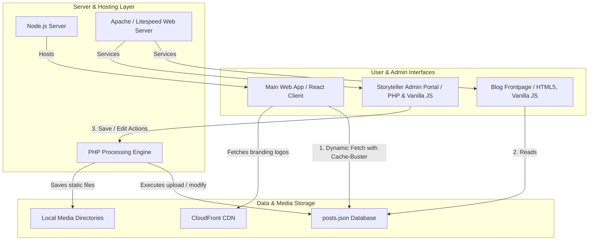
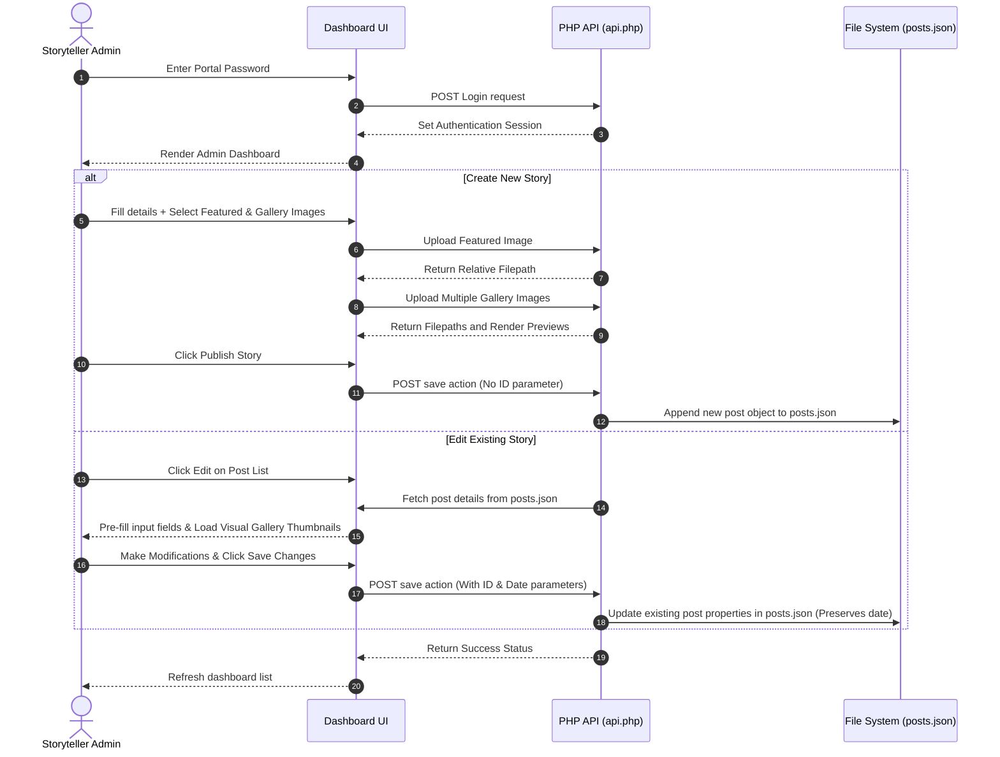
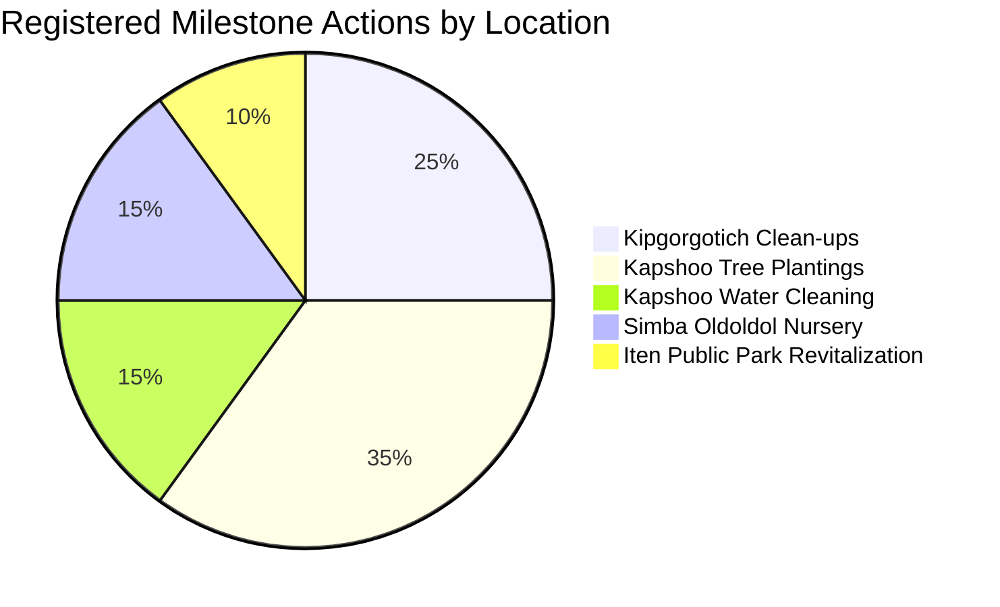

# Clean Heights Initiative - Digital Infrastructure and Storyteller Suite

This repository contains the complete production-grade digital infrastructure, interactive web systems, and dedicated field reporting tools for the Clean Heights Initiative based in Iten, Kenya.

The platform is designed to connect global supporters with local environmental conservation efforts on the Elgeyo Escarpment, facilitating transparent field reporting and community engagement.

---

## Technical Architecture Overview

The system utilizes a dual-tier decoupled architecture:
1. **Main Web Application**: A highly interactive, client-side SPA built with React, TypeScript, and Vite, supported by a Node.js Express server to handle routing, static page rendering, and API gateway requests.
2. **Storyteller Suite (Subdomain Blog)**: A super-fast, lightweight, custom PHP-driven blog platform containing an advanced story creator, image editor, media upload pipeline, and multi-file gallery system.



---

## Detailed Data and Process Flow

### Story Creation and Modification Pipeline
The admin dashboard supports draft creation, full image pre-compression, visual multi-image gallery uploading, and retrospective post modification while preserving original publication timestamps.



---

## Core Technical Specifications

### Core Technologies
| Component | Technology | Version | Purpose |
| :--- | :--- | :--- | :--- |
| **Frontend Framework** | React | 18.3.1 | Core UI structure and responsive component model |
| **Build Tooling** | Vite | 5.4.1 | Ultra-fast client compilation and modular bundling |
| **Type Safety** | TypeScript | 5.5.3 | Robust static type safety across frontend resources |
| **Style Sheet Layer** | CSS Custom Properties | CSS3 | Custom high-end premium fluid typography system |
| **Backend Processing** | PHP | 8.1+ | Media processing, filesystem reading, and authentication |
| **Server Runtime** | Node.js | 20.x | Production server pipeline and local development gateway |
| **Static Database** | JSON Database | RFC 8259 | Lightweight, serverless storage for field posts |

---

## Field Impact Metrics and Distribution

The digital platform tracks and manages multiple conservation programs in the Elgeyo Marakwet region.

### Volume distribution of conservation and environmental actions:



### Milestone Performance Metrics

| Milestone Target Location | Program Classification | Primary Action Taken | Waste Recovered (kg) | Seedlings Planted |
| :--- | :--- | :--- | :--- | :--- |
| **Kapshoo Trails** | Escarpment Conservation | Community Trail Cleanup | 200 | 0 |
| **Kapshoo Forest** | Escarpment Conservation | Native Tree Reforestation | 0 | 1200 |
| **Kipgorgotich** | Water Resource Security | Water Point Silt Removal | 150 | 0 |
| **Simba Oldoldol** | Reforestation & Nurseries | Seedling Cultivation | 0 | 850 |
| **Oldoldol Catchment** | Water Resource Security | Riverbanks Protection | 80 | 300 |
| **Iten Public Park** | Urban Reclamation | Public Park Restoration | 350 | 120 |

---

## Project Repository File Structure

```text
clean-heights-initiative/
├── blog_subdomain/                     # Decoupled Blog Subdomain
│   ├── .htaccess                       # Custom Apache CORS headers config
│   ├── admin/                          # Editorial Dashboard
│   │   ├── api.php                     # Central operations PHP controller
│   │   ├── config.php.dist             # Template for secure portal authentication
│   │   └── index.html                  # Responsive visual Admin Panel
│   ├── data/
│   │   └── posts.json                  # Flat JSON document store
│   ├── images/                         # Uploaded story assets directory
│   ├── index.html                      # Storyteller Suite front landing page
│   ├── script.js                       # Vanilla client-side article parser
│   └── style.css                       # Premium custom fluid stylesheet
├── client/                             # React Client SPA Architecture
│   ├── public/                         # Public static web assets
│   ├── src/                            # Source Files
│   │   ├── components/                 # Reusable UI component modules
│   │   ├── hooks/                      # Custom React hooks (scroll animations, etc.)
│   │   ├── pages/                      # Layout views (Home, About, Milestones)
│   │   ├── App.tsx                     # Main routing and navigation structure
│   │   └── index.css                   # Custom global visual theme tokens
├── server/                             # Express Backend Server Gateway
│   └── index.ts                        # Main Node.js gateway routing
├── package.json                        # Node dependency manifest
└── tsconfig.json                       # Global TypeScript options configuration
```

---

## Security Protocols & Repository Integrity

### Password Isolation
To avoid hardcoding sensitive credentials in version control, the administrative portal password has been separated from the application logic:
* The system utilizes a runtime-loaded configuration file `blog_subdomain/admin/config.php` to read the portal credential.
* This file is ignored by Git in `.gitignore` to prevent any possibility of database or portal password leak.
* The repository includes a `config.php.dist` file which serves as a template.

### Setup Instructions for Production Deployment:
1. Access your server's file directory under `blog_subdomain/admin/`.
2. Locate `config.php.dist` and rename or copy it to `config.php`.
3. Open `config.php` in a text editor and update the default password to a strong value:
   ```php
   define('ADMIN_PASSWORD', 'your_extremely_secure_password_here');
   ```

### Cross-Origin Resource Sharing (CORS) Security
Subdomain communication relies on specific allowed access paths to prevent clickjacking and unauthorized data theft:
* The `.htaccess` file inside `blog_subdomain/` restricts custom headers to trusted endpoints.
* Frontend requests dynamically attach a unique, runtime-generated timestamp token (`?t=timestamp`) to bypass downstream proxy caching, ensuring all content modifications reflect instantly to end users.

---

## Local Development and Operations Setup

### Prerequisites
* **Node.js** v20 or higher
* **pnpm** package manager installed globally

### Installation & Initialization
1. Clone the repository to your local system:
   ```bash
   git clone https://github.com/Royfinnest254/Clean_Heights_initiative.git
   ```
2. Navigate into the project root folder:
   ```bash
   cd clean-heights-initiative
   ```
3. Install the required Node dependencies:
   ```bash
   pnpm install
   ```
4. Build the client bundle:
   ```bash
   pnpm run build
   ```
5. Launch the local Node gateway server:
   ```bash
   pnpm run dev
   ```
   * The main website will be accessible locally on `http://localhost:3000`.

### Running the Blog Subdomain Locally
Since the blog's backend operations run on PHP, you can launch a local server specifically for testing the frontend UI layout without needing to compile PHP dependencies locally:
```bash
node serve_blog.mjs
```
* The local mock server will launch on `http://localhost:3002`.

---

## Build, Compilations, and Optimization Tools

The project contains custom automation engines designed to optimize all production assets for namecheap or standard shared-hosting setups:

1. **`compress_images.mjs`**: Automatically compresses and optimizes all large JPEG/PNG assets recursively inside the `client/public/` folder, converting them into fast-loading WebP format to achieve exceptional load speeds.
2. **`zip_production_final.mjs`**: Compiles all production bundles, runs Vite treeshaking, integrates modern static router redirection structures, and builds the finalized production zip package (`production_build_final.zip`) ready for cPanel upload.
